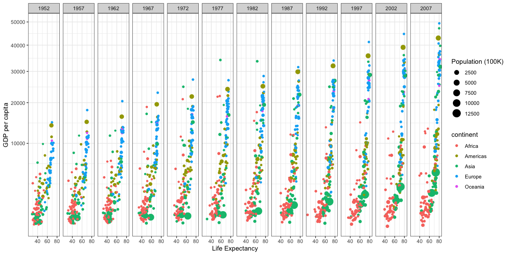

```r
# Use this R-Chunk to import all your datasets!
```

## Background

_This project uses the data from Hans Rosling. We will be creating a graphic_

## Data Wrangling


```r
# Use this R-Chunk to clean & wrangle your data!
gapminder2 <- filter(gapminder, country != "Kuwait")
```

## Data Visualization


```r
# Use this R-Chunk to plot & visualize your data!
p <- ggplot(data = gapminder2) +
  geom_point(mapping = aes(x = lifeExp, y = gdpPercap, size = pop/100000, color = continent)) +
  facet_wrap(~year, nrow = 1) +
  scale_y_continuous(trans = "sqrt") +
  theme_bw() 
  
p + labs(x = "Life Expectancy") + labs(y = "GDP per capita") + labs(size = "Population (100K)")
```

<!-- -->

```r
ggsave("gapminder.png")
```

## Conclusions
