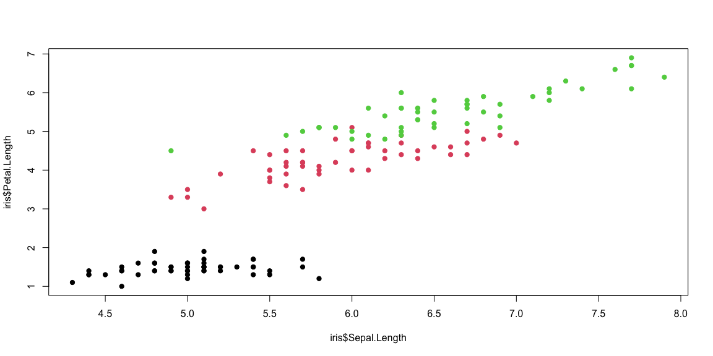

```r
# Use this R-Chunk to import all your datasets!
```

## Background

_"Just to give you[me] paractice putting code in file..."_

## Data Wrangling


```r
# Use this R-Chunk to clean & wrangle your data!
```

## Data Visualization


```r
# Use this R-Chunk to plot & visualize your data!
plot(x = iris$Sepal.Length,
     y = iris$Petal.Length,
     col = iris$Species, pch = 19)
```

<!-- -->


## Conclusions (Links to articles and discussion on articles)

[The First Article](https://pudding.cool/2021/12/sesame/) answered the 
question, "Why should I care about food allergies?"

Question 1: What is unique or good about the visualization?

The visualization was an interactive animation that would share information as the reader interacted until the end. For me, this was a very entertaining way to read an article and to have my attention all the way until the end. Other than the animation, the article included visualizations that utilized multiple encoding methods used by humans. There was a chart that emphasized the proportion of adults and children through it's illustration. It colored the one adult/child with yellow who had an allergy, and the others white indicating they don't. Another chart illustrated the top nine food allergies in the U.S. with a bar graph whose individual bar lengths represented the number of people in the U.S. who had that particular allergy. 

Question 2: What could be better?

The animation was very entertaining and enticed me to see the article until the end. However, I did find the animation a tad bit distracting from the actual content and message the article was trying to convey. I went through the article 2-3 to understand it's message. (I am ADD)

[The Second Article](https://ourworldindata.org/global-economic-inequality-introduction) answered the question, "What impacts my living conditions most?"

Question 1: What is unique or good about the visualization?

The first visualization was a graph that illustrated the distribution of income in terms of dollars earned per day among people globally. The graph also emphasised certain points of reference such as the U.S. Median number of dollars earned per day. This made it easier for someone who lives in the U.S. to grasp how income is comparitevely distributed. The article also included a graph with that had several scatterplots to illustrate the relationships between income and several conditions of living such as life expectancy, access to electricity, years of education, medical doctors, and access to clean drinking water to name multiple. These each were easy to read and clearly showed close relationships between income and each of these living conditions. 

Question 2: What could be better?

The article argued that there was need for redistribution of wealth globally. While I am not disagreeing with this idea, this was the only portion of the article that didn't have data or data visualization to help explain this point. I think to make the article stronger, they could perhaps use data from an individual country that practices wealth distribution and use visualization techniques that showed how this helped the country in different metrics. 

[The Third Article](https://priceonomics.com/bootcamp-satisfaction-statistics-what-jobs-can-you/)

Question 1: What is unique or good about the visualization?

The visualizations were pretty straightforward in this article. The first visualization was a bargraph that illustrated the percentage of people that gave specific review score out of 5 with 1 being the lowest and 5 being the highest. 
The largest bars in the bar graph were for 4/5 and 5/5 scores. This clearly showed that most people give high reviews to bootcamps.The next graph illustrated the proportion of graduates who left reviews with jobs that occupied specific jobs. This graph shows that a significant proportion hold some sort of technical job involving development and coding through the bargraphs with their accompanying numbers. 

Question 2: What could be better?

The other visualizations were not extremely helpful in my opinion. They illustrate overall bootcamp satisfaction, bootcamp job support satisfaction, and bootcamp curriculum satisfaction. They list the revewiers rating and job title with each. While this can appear to be helpful, we actually are not aware of the true proportion of bootcamp graduates with the specific job titles (including unemployment) there actually are. If you recall, the previous graphs only showed the proportion of reviewers ratings among those that posted a review and the  proportion of graduates that occupied specific jobs who actually had a job. According to the graph indication the proportion of graduates that occupy specific jobs, we know that 19.3 percent of graduates are software developers given that they have a job. This is not the same thing as the proportion of graduates that are software developers. If the number of graduates who don't have a job is significant, this observation can be misleading in terms of expectations for a prospective bootcamp student. Knowing this would render the graphs illustrating bootcamp satisfaction of little weight as they primarily show high ratings among graduates with jobs (at-least a 3.9). The only "low rating" of a 2.1 is shown by those who are unemployed. This however could make up 10%, 20% or 50% of total graduates. Of course, we aren't sure since this data isn't given or illustrated. 
